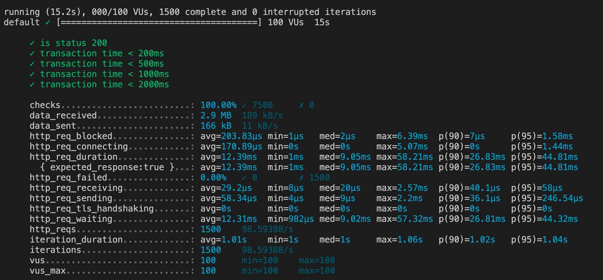

# SDC-questionsAndAnswers-API

This project is about build one of the service that make up the full API to support FEC application(https://github.com/cynthia2604/FEC-HRLAX48). The project requires to first design a database and server that meet the requirements of application, and then deploy and scale the service to support (a minimum of) 100 requests per second on EC2 using a t2.micro instance.


### Built With

* [Node.js] (https://nodejs.dev/)
* [Express] (https://expressjs.com/)
* [PostgreSQL] (https://www.postgresql.org/)
* [AWS] (https://aws.amazon.com/)
* [NGINX] (https://www.nginx.com/)

### Installation

* Make a copy of the file `.env_example` and rename to `.env`, assign the database connection infomation.

* Install dependencies
```sh
npm install
```
* Start the server
```sh
npm run server
```

## Loading Tests
K6 loading tests are run with `K6 run` and following path of file. Need K6 installed.
